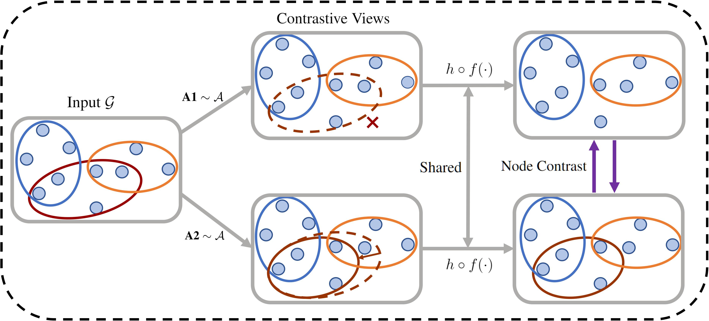

# HyperGCL
This is the repo for our NeurIPS 2022 paper based on Pytorch.

[**Augmentations in Hypergraph Contrastive Learning: Fabricated and Generative**](https://arxiv.org/abs/2210.03801)

by Tianxin Wei*, Yuning You*, Tianlong Chen, Yang Shen, Jingrui He, Zhangyang Wang.

## Overview
This paper targets at improving the generalizability of hypergraph neural networks through contrastive learning. We study the problem of how to construct contrastive views of hypergraphs via augmentations. Extensive analysis and experiments are conducted to assess the performance of our fabricated and generative augmentations on comprehensive types of data sets.



## Enviroment
Here we list our runing environment.
```
python==3.6.13
torch==1.10.2
tqdm==4.62.3
scipy==1.5.4
scikit-learn==0.24.2
numpy==1.19.2
torch-geometric==2.0.3
torch-scatter==2.0.9
torch-sparse==0.6.12
```
where we used the latest version of Pytorch-Geometric at that time. Other versions of these packages may also be compatible.

## Data Set

All the data files are stored in the "data" folder.

To conduct experiments, please unzip the raw_data.zip in the folder.
```
cd data/
unzip raw_data.zip
```
It will extract the data sets into the corresponding folder.

Other data sets like the attack data are also stored in the relevant folder.

## Experiments
All core code are in the folder "src". Please enter the folder first to run the experiments. 
```
cd src/
```
Due to the large number of data sets, we write the script .sh files for each series of experiments. To reproduce the experiments of generative augmentations, please run:
```
./train_auto.sh 0
```
where 0 is the GPU device id to use. We write most of the important parameters and instructions in the script file. If you want to change the data set or hyper-parameters of the model, please go through the script and change the corresponding places. If you find the experiments on some data sets consume too large memory, please consider lower the sampled sub-hypergraph size "sub_size" in the code.

To reproduce the experiments of fabricated augmentations, please run:
```
./train.sh 0 edge
```
where 0 is the GPU device id to use and edge denotes the fabricated augmentation method A2. We write most of the important parameters and instructions in the script file. Other series of experiments are written in the same philosophy, if you're interested, please run other scripts. Note that random seeds are used to generate different data splits, other processes are not fully fixed.

## Acknowledgements
The data sets and part of our code refer to the [AllSet](https://github.com/jianhao2016/AllSet) repo. Many thanks for them.

## Citation
If you find our code or paper useful, please kindly cite our paper.

```
@inproceedings{wei2022hypergcl,
 author = {Wei, Tianxin and You, Yuning and Chen, Tianlong and Shen, Yang and He, Jinghui and Wang, Zhangyang},
 booktitle = {Advances in Neural Information Processing Systems},
 title = {Augmentations in Hypergraph Contrastive Learning: Fabricated and Generative},
 year = {2022}
}
```

